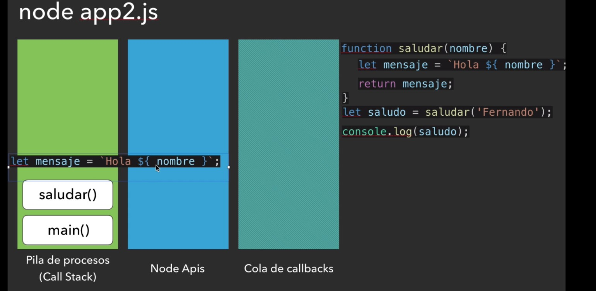

# UDY-NODEJSCEROAEXPERTO-01-holamundo

Excuta con node app.js

Aqui lo que hace es establecer esta funcion o este callback en una pila de ejecucion, 
esto va a caer a un stack de procedimientos que tiene que ejecutar.

En el siguiente ejemplo tenemos un ejemplo de como funciona nodejs. 

# Ejemplo1
En este caso todo programa de NodeJs empieza por la funcion de main.

Y lo que hace con la ejecucion del programa es lo siguiente.

1. Va a tomar la primera linea de codigo y la va a poner en la pila de procesos o tambien conocido como Call Stack, y despues de ejecutarla la va a eliminar.

2. Luego toma la segunda linea de codigo, la pone en la pila de procesos, la ejecuta, imprimi "Hola Fernando" en este caso y la elimina

3. Y asi sucesivamente hasta llegar a la ultima linea de codigo.

4. Cuando ya no tenemos algo mas en la pila de procesos, lo que va a hacer node sera terminar la funcion main que esta en la pila de procesos.

5. En este caso no hemos utilizado nada de NodeApi, que por lo general son utilizados con procesos asincronos junto con la cola de Call Backs.

# **Video 11** Ciclo de vida de un proceso en Node
# Ejemplo 2

Lo que hace aqui es lo siguiente.

1. Cuando ponemos node app2.js lo que hace es crear el main.

2. Lee la primera linea de codigo y es una funcion y lo que hace es registrar esta funcion, pero no la ejecuta.

3. Despues ejecuta la siguiente linea de codigo `let saludo = saludar("Fernando")`, y lo ejecuta y esto hace que ahora en el call back este main, y despues saludar() lo que por consecuencia ahora el call back se veria de la siguiente forma.

Nota. Cuando se realiza el return es cuando ya se termina de ejecutar el metodo, por lo tanto la funcion `saludar()` ya se quita de la pila de procesos.

4. Despues se ejecuta el ultima linea de codigo y se elimina de la pila de procesos, y por ultimo se termina el procesos del metodo `main`.

# Ejemplo 3.

1. Ejecutamos el comando `node app3.js` y lo que va a hacer es crear el metodo main.

2. Despues toma la primera linea de codigo y lo coloca en la pila de procesos y lo ejecuta y lo elimina de la pila de procesos.

3. Despues toma el setTimeOut y lo pone en la pila de procesos y lo registra, **Nota. Solo lo registra, no lo esta ejecutando.**, en este caso no lo esta ejecutando todavia, ya que esto se debe de ejecutar en 3 segundos.

4. Y por lo tanto, como solo se registro el primer setTimeOut, no la va a eliminar de la pila de procesos ya que todavia no esta resuelta, entonces lo va a colocar en la caja de `Node Apis` y mientras esta funcion no haya pasado los 3 segundos, ahi va a estar esperando. 

5. Y luego registra el segundo TimeOut, pero al registrar no significa que se va a ejecutar luego luego.

6. Y luego registra el tercer TimeOut, pero al registrar no significa que se va a ejecutar luego luego. pero por lo tanto, en este instante es probable que ya pasaron los zero segundos del segundo timeOut, entonces node va a pasar el segundo timeOut a una pila de Cola de Callbacks.

**La pila de callbacks son** todos los procesos que ya estan listos para ser ejecutados, pero hay que esperar que la pila de procesos que esta actualmente corriendo en `Call Stack` termine, que en este caso el que esta en Call Stack es el main y por lo tanto la pila de Cola de callbacks, va a esperar el momento para ser ejecutado, y por lo tanto empieza a terminar todo lo que hay en main

7. Que termine el metodo main, no significa que la app de node js haya terminado, ya que hay otros procesos ya que hay otros procesos que estan aqui en `Cola de callbacks` 

**Nota. En este punto, hay dos en `Cola de callbacks` ya que estos solo duran 0 segundos, pero el otro esta en `Node Apis` ya que este dura 3 segundos, y aun no se ah terminado esos 3 segundos**

8. Despues lo que esta en Cola de callbacks se pasan a la `pila de procesos` y se ejecutan

Entonces la secuencia es `Call Stack` -> `Node Apis` -> `Cola de callbacks` y despues llegan a `Call Stack`, y node cuando ve que ya no hay nada en ninguno barras, entonces es ahi cuando dar por finalizado la ejecucion de este programa.